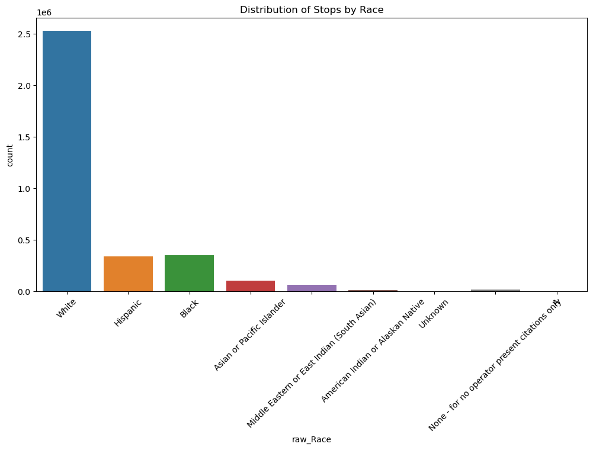
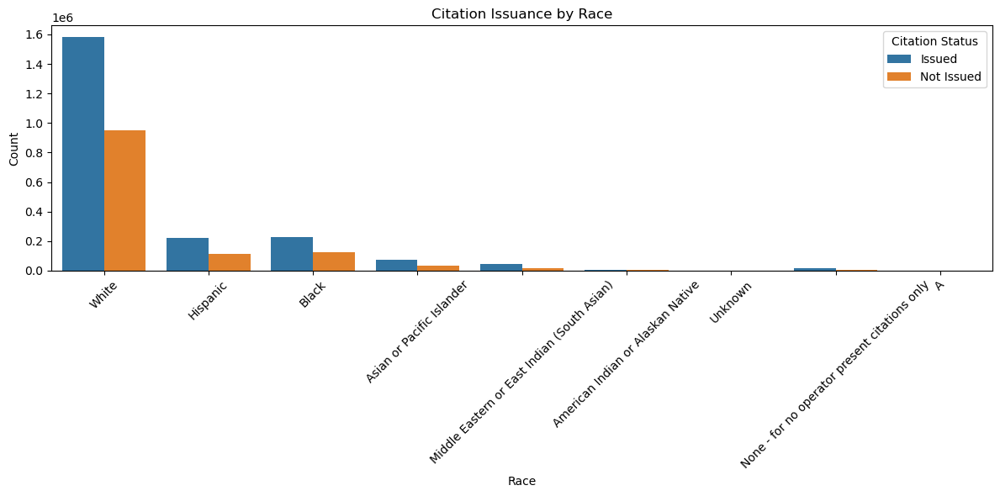
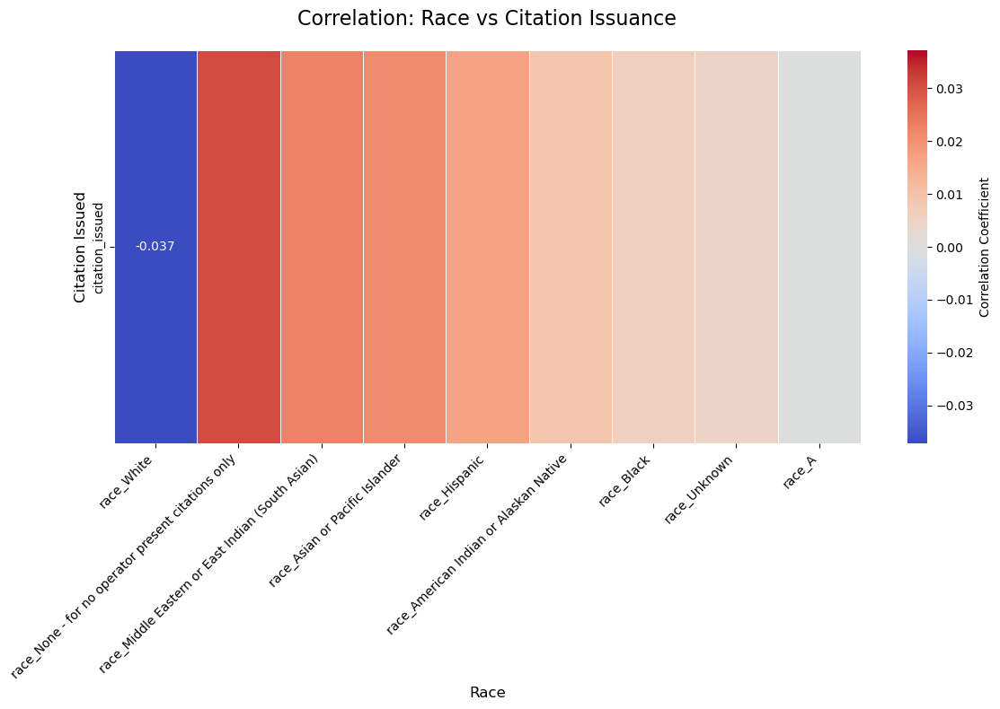
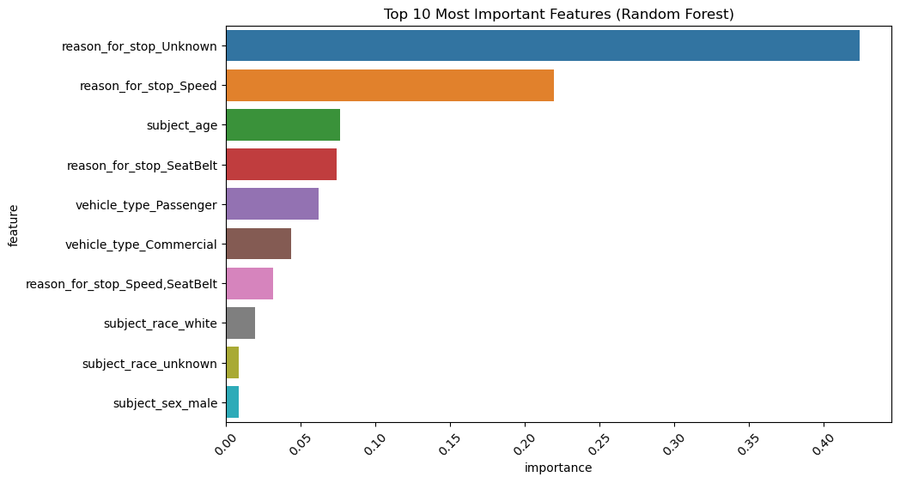
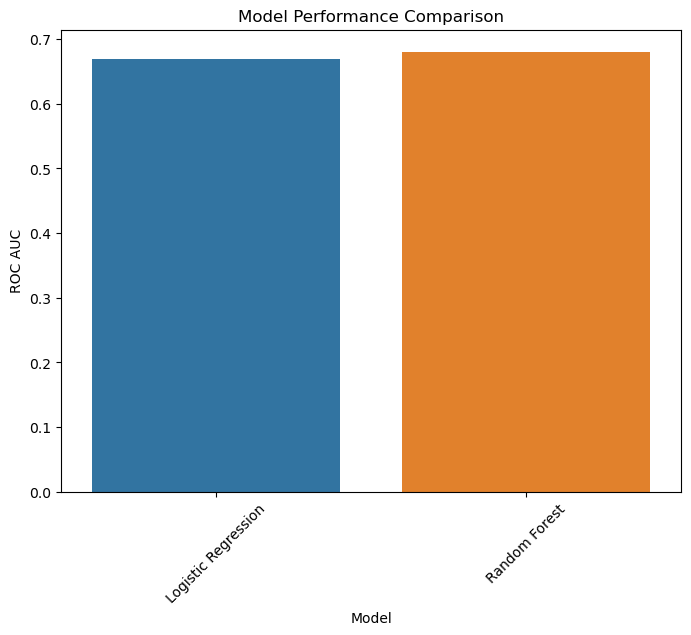

# Traffic Stop Analysis
Thanks for checking out my project! This project questions the question of race being correlated with citation issuance and traffic stops. The data is from my home state of Massachusetts. First, let's take a look at the distribution of stops by race. 

We see that the white race is stopped considerably more than any other race in Massachusetts. Ok, but that is not sufficient information. Let's take a look at citation issuance by race. 

Hm. Seems just about half of all races recieve a citation. But what about the actual statistics? Let's take a look.
# The Numbers

Interesting! It seems there is no mathematical correlation. Here are some stats: 
# Pearson Correlation Coefficients and p-values:
White: Correlation = -0.0372, p-value = 0.0000
Hispanic: Correlation = 0.0169, p-value = 0.0000
Black: Correlation = 0.0060, p-value = 0.0000
Asian or Pacific Islander: Correlation = 0.0212, p-value = 0.0000
Middle Eastern or East Indian (South Asian): Correlation = 0.0224, p-value = 0.0000
American Indian or Alaskan Native: Correlation = 0.0090, p-value = 0.0000

Looks good! But the work here is not done. 
# Preprocessing 
Before choosing a model, I must preprocess the data and get it ready for modeling. I created dummy features for the necessary values, such as subject race, sex, and reason for stop. I had to scale the data as this data set had a staggering 3 million entries. I made a train/test split with a test size of 20%. Okay, now we are ready to dive into modeling.
# Modeling 
Let's make some models! I made two models as the modeling rubric for this project said 2 to 3, and after experimenting with 3 models, I found only 2 models were necessary. I tried using an SVM but it took more than a day to run and it was still going! So, I decided on logistic regression and random forest. I chose logistic regression because it is great for feature importance, and random forest for those pesky non-linear relationships. Let's take a look at how these models performed. Logistic regression landed a ROC AUC score of 0.669. Let's see at which features the model deemed most important. 

We see here it found that not wearing a seatbelt and speeding were highly influential in the reason for stops. That seems swell, but what about random forest? The random forest model landed a ROC AUC score of 0.680, much better than logistic regression. What features did random forest find most important? Let's see. 

We see it found the most important features were unknown or speeding. I left in the unknown reason for stops as that only further begs the question of race being correlated with citation issuance! This stat here seems to prove the null hypothesis, however we see that both models agree on speeding as a large reason for stopping. After these scores and analysis, I decided that my final model will be random forest. It performed better than logistic regression, as shown here:

# Summary
In summary, after all the tests and rigamarole, we can predict that about 50% of the time, a subject is issued a citation, regardless of race or the reason for stop.

